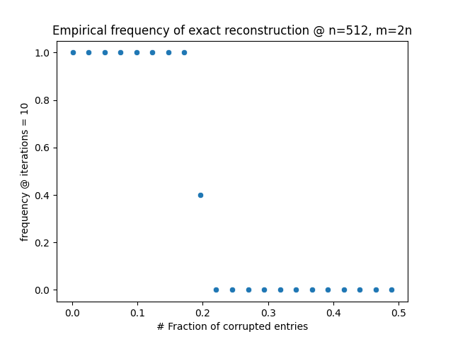
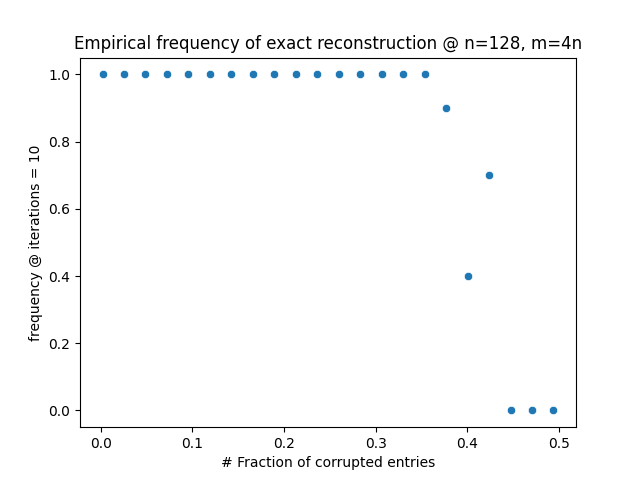

# Decoding by Linear Programming

### Article to Analyze
**"Decoding by Linear Programming" by Candes (2005)**

*Following notes must be considered as a draft in progress ...*

---

### Problem Statement
Given $A \in \mathbb{R}^{m \times n}$ and $y$, find $f$ such that:  

$$Af + e = y$$

Is it possible to recover $f$ exactly? What are the conditions to achieve this goal?

---

### Context
This article addresses the error-correcting problem where a code $f$ is transformed into a larger representation to improve resilience to noise in a transmission channel. Thus, the following assumptions about $A$ are valid:

1. $m > n$
2. $A$ is full-rank

The equation $Af + e = y$ is equivalent to $Af = b$, where $b = y - e$.

From linear algebra:
- $r(A) \leq \min(m, n)$
- $r(A) = n - \dim[k(A)]$ (rank-nullity theorem)  
By definition, full-rank implies: $r(A) = \min(m, n)$

---

### Analysis of Cases

#### Case 1: $m < n$
- $r(A) = m$, with $\text{col}(A) = \\{c_1, \dots, c_m\\}, c_i \in \mathbb{R}^m$
- $\dim[k(A)] = n - m$

The linear system $Af = b$ has a solution since $\text{col}(A) = \mathbb{R}^m$, but it is not unique because $\dim[k(A)] > 0$. This is resolved by adding a constraint, e.g.,  

$$f^* = \arg\min \|f\| \quad \text{subject to } b = Af$$

**Assumption**: The minimum norm solution is the best.

#### Case 2: $m = n$
- $r(A) = m$, with $\text{col}(A) = \\{c_1, \dots, c_m\\}, c_i \in \mathbb{R}^m$
- $\dim[k(A)] = 0$

The linear system $Af = b$ has a unique solution since $\text{col}(A) = \mathbb{R}^m$ and $\dim[k(A)] = 0$. This is resolved by:  

$$f^*: b = Af, \quad A^{-1} \text{ exists.}$$

#### Case 3: $m > n$(Paper Case)
- $r(A) = n$, with $\text{col}(A) = \\{c_1, \dots, c_n\\}, c_i \in \mathbb{R}^m$
- $\dim[k(A)] = n - n = 0$

The linear system $Af = b $has a solution if and only if $b \in \text{col}(A)$.  
- If $b \in \text{col}(A)$, the solution is unique ($\dim[k(A)] = 0$). Solved by finding $f$:  

$$Af = b$$

- If $b \not\in \text{col}(A)$, the system is incompatible. Solved by finding $f$:  

$$\|Af - b\| \text{ is minimized.}$$

**Note:** Both cases can be solved by minimizing$\|Af - b\|$.

---

### Reformulated Problem
Given $Af + e = y$, find $F \in \mathbb{R}^{p \times m}$ such that:  

$$FA = 0$$

This leads to:  

$$Fy = Fe, \quad \text{let } y_m = Fy$$

**New Problem Statement:** Solve $Fe = y_m$.  
- $y_m \in \text{col}(F)$, so the system has a solution.

#### Dimensionality of $F$
For $FA = 0$, the span of $\text{col}(A)$ ($n$-dimensional in $\mathbb{R}^m$) must be included in the kernel of $F$:  

$$\dim[k(F)] \geq n$$

From rank-nullity:

$$r(F) = m - \dim[k(F)] \implies r(F) \leq m - n$$

Nota that if $F$ is full-rank and $p > m$, then $r(F) = m$, which is an absurd because $n \leq 0$. Otherwise, if $p \leq m$, then it is a "compressed sensing" statement.

---

### Noise Assumption
Assume noise is sparse $\|e\|_0 \leq \rho \cdot m$, It makes sense to minimize $e$:  

$$e^* = \arg\min \|e\|_0 \quad \text{subject to } Fe = y_m \quad \text{(P1)}$$

**Assumption:** The minimum $e$ is optimal.

#### $\ell_0 / \ell_1$ Equivalence
Under certain conditions, (P1) is equivalent to:  

$$e^* = \arg\min \|e\|_1 \quad \text{subject to } Fe = y_m \quad \text{(P2)} $$

#### Dual Equivalence
The paper proves equivalence between (P2) and:  

$$e^* = \arg\min \|Fe - y_m\|_1 \quad \text{(P3)}$$

---

### Conclusion
Given $A \in \mathbb{R}^{m \times n}$, we seek $f$ such that $Af + e = y$ under the assumptions:
- $m > n$
- $A$ is full-rank
- $\|e\|_0$ is as low as possible.

If $A$ has a special structure (based on $\ell_0 / \ell_1$ equivalence), the solution is obtained by solving:  

$$e^* = \arg\min \|Fe - y_m\|_1 \quad \text{(P)}$$

---

### Key Points to Evaluate
1. Develop a solver for (P) using linear programming.
2. Construct $A$-matrices to test the maximum density level of $e$ for exact recovery of $f$:
   - Build $A \in \mathbb{R}^{m \times n}$ with structure to 
   satisfy$\ell_0 / \ell_1$ equivalence.
   - Build random $f$.
   - Build $F \in \mathbb{R}^{p \times m}$ from $A$
   - For $\rho \in [0, 1]$:
     - $n$-times:
       - Build sparse random $e$.
       - Compute $y = Af + e$
       - Compute$\hat{y} = F y$
       - Solve (P) given $F$ and $\hat{y}$.
       - If $e^* = e$, increment $f_{\rho}$ by $1/n$.
   - Plot $\rho$ vs. $f_{\rho}$ to find the critical threshold.

### Results

Reproducing paper figs 2a, 2b and 3

